🏨 Hotel Management System (Java)

A desktop-based Hotel Management System developed using Java Swing, AWT, JDBC, and Oracle SQL, designed to help hotel administrators manage daily hotel operations efficiently.

📌 Project Overview

This application provides a centralized system for hotel administration, allowing an admin user to manage employees, rooms, customers, drivers, and billing operations.
It focuses on simplifying hotel workflows such as check-in, check-out, room allocation, and payment tracking.

👤 User Role Admin

- Secure login system
- Full control over hotel operation

✨ Features
<br>
🔐 Authentication
- Admin login system for secured access

👥 Employee Management
1) Add and manage hotel employees such as:
- Manager
- Chef
- Driver
- Housekeeper
- Kitchen Staff
- Waiter
- Front Desk Staff

2) View employee details

🏨 Room Management

1) Add rooms with:
- Room type
- Bed size
- Price

2) Track room status:
- Availability (Available / Occupied)
- Cleaning status (Clean / Not Clean)

🚗 Driver Management

1) Add drivers with:
- Name and personal details
- Car company
- Car model

2) View driver information

🧑‍💼 Customer Management

- Add new customers
- Allocate rooms to customers
- View customer details
- Update customer room information (room change)

💳 Check-Out & Billing
- Customer check-out functionality
- Calculates remaining amount due
- Updates room availability after check-out
- Payment confirmation displayed in UI

🛠 Tech Stack

- Java 23
- Java Swing & AWT (GUI)
- JDBC
- Oracle SQL

🗄 Database

Database: Oracle SQL

SQL schema is provided in:

- database/HMS_schema.sql


Tables include:

- Employee
- Room
- Customer
- Driver
- Login

⚠️ Oracle JDBC driver (ojdbc) is required to run the project.

▶️ How to Run the Project

1) Create the database using Oracle SQL Developer
```text
 Run database/HMS_schema.sql
```
2) Add Oracle JDBC driver (ojdbc11.jar) to the project

3) Update database credentials in the connection class

4) Run the FirstScreen.java class from IntelliJ

5) Login as "admin" with "admin123" as password and start managing hotel operations

📂 Project Structure

```text
HotelManagementSystem/
├── src/
│   ├── HotelManagementSystem/
│   └── icons_Hotel/
├── database/
│   └── HMS_schema.sql
└── .gitignore
```

## Screenshots

### First Page
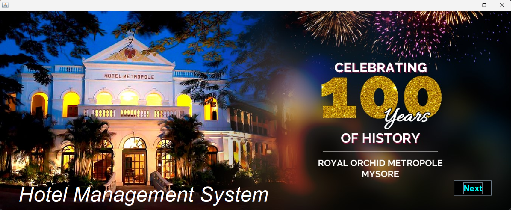

### Login Page


### Dashboard
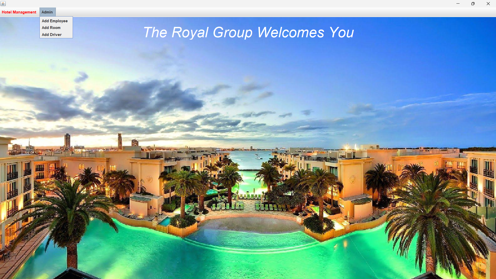

### Add Employee
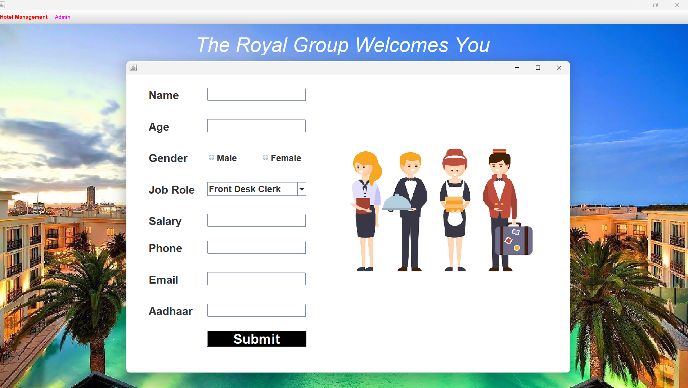

### Add Room
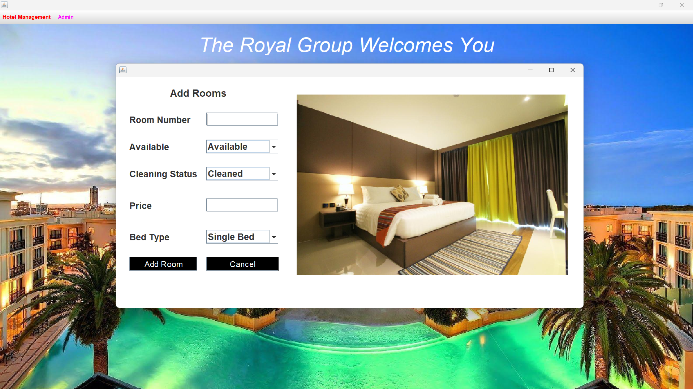

### Add Driver
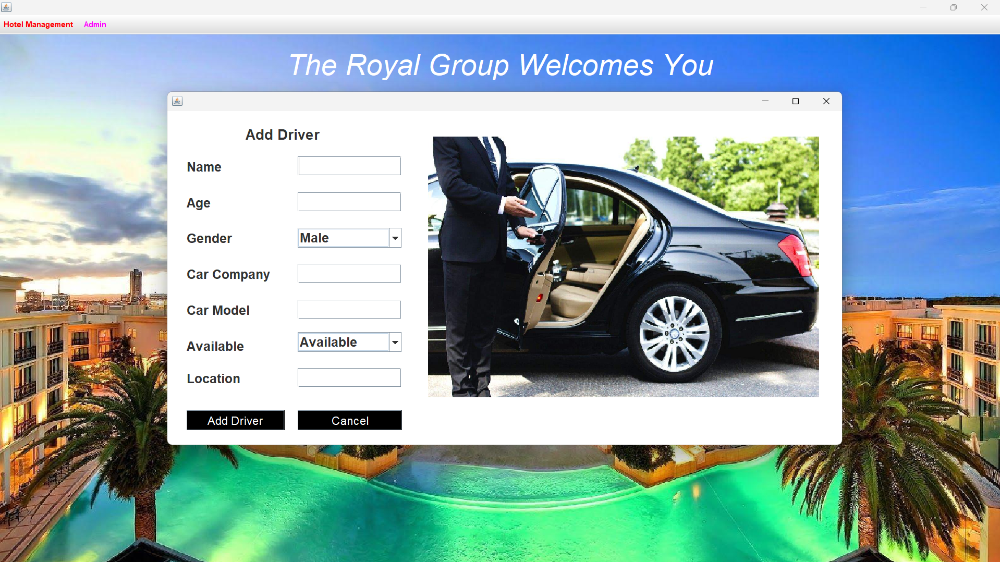

### Reception
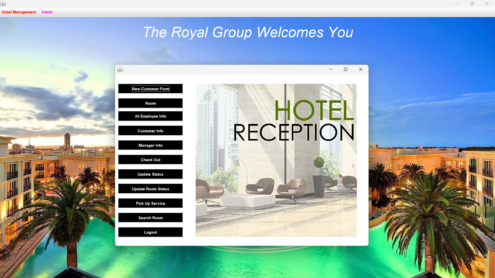

### Add Customer
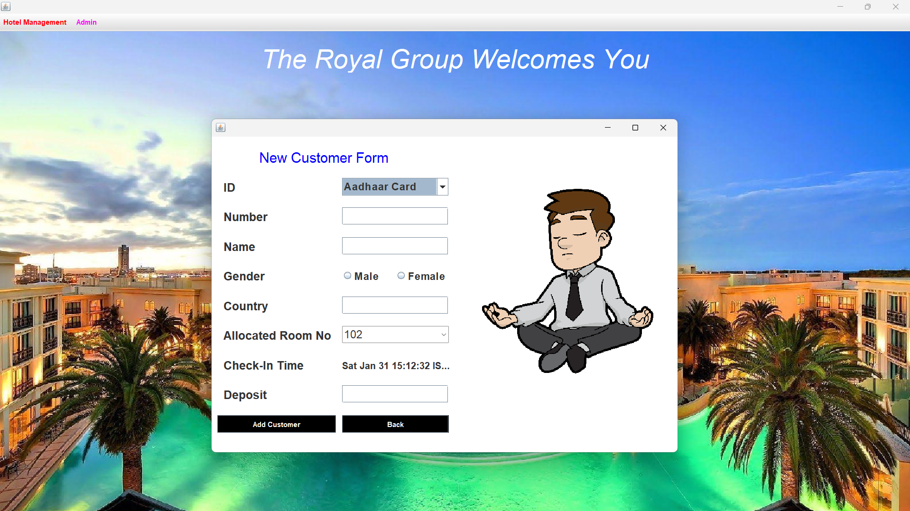

### Room Info
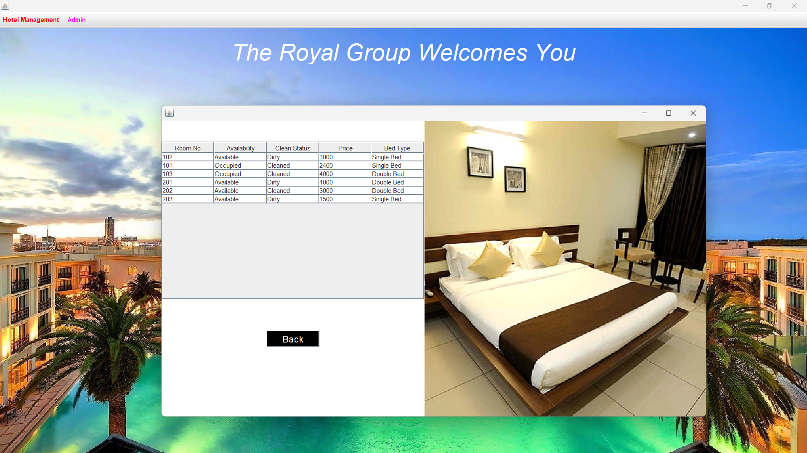

### PickUp Service
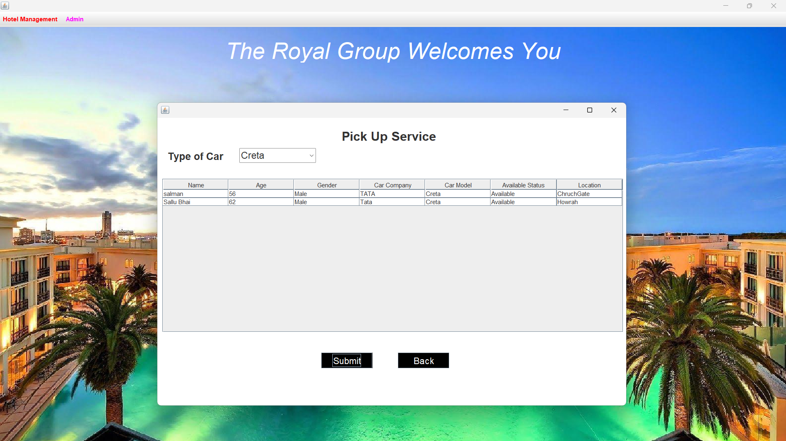

### Update Customer Status
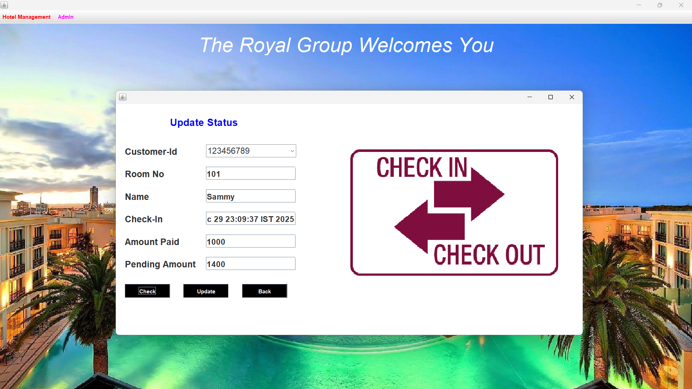

### CheckOut
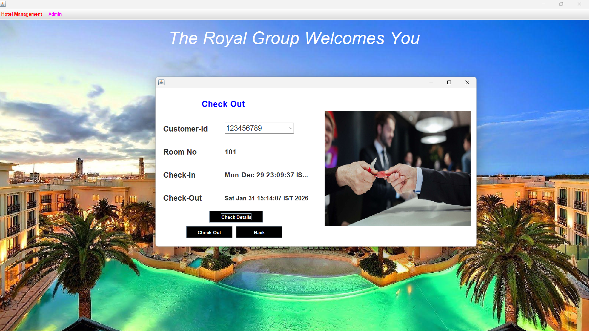

### Update Room Status
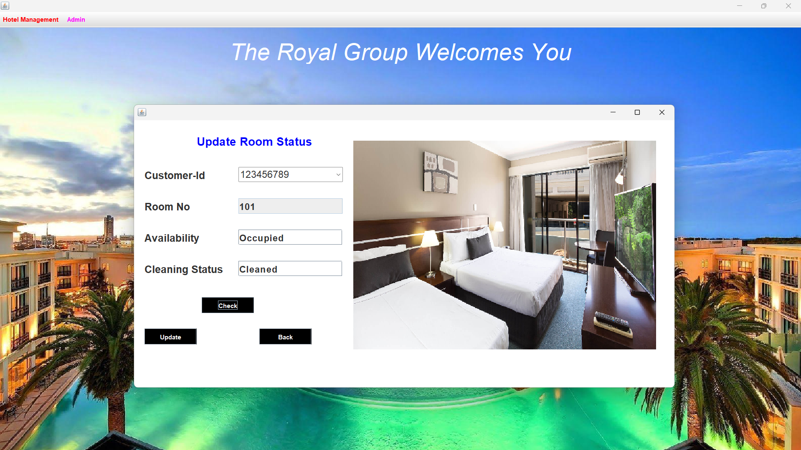


